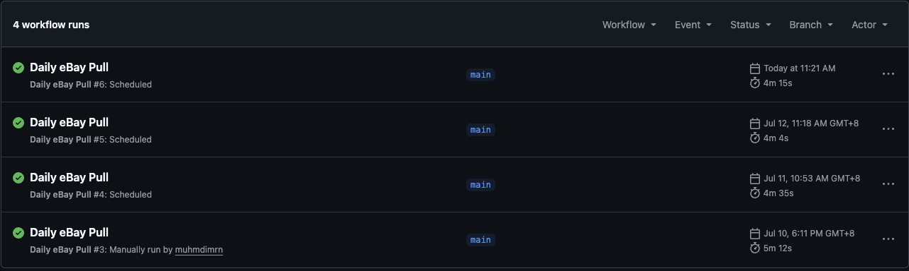
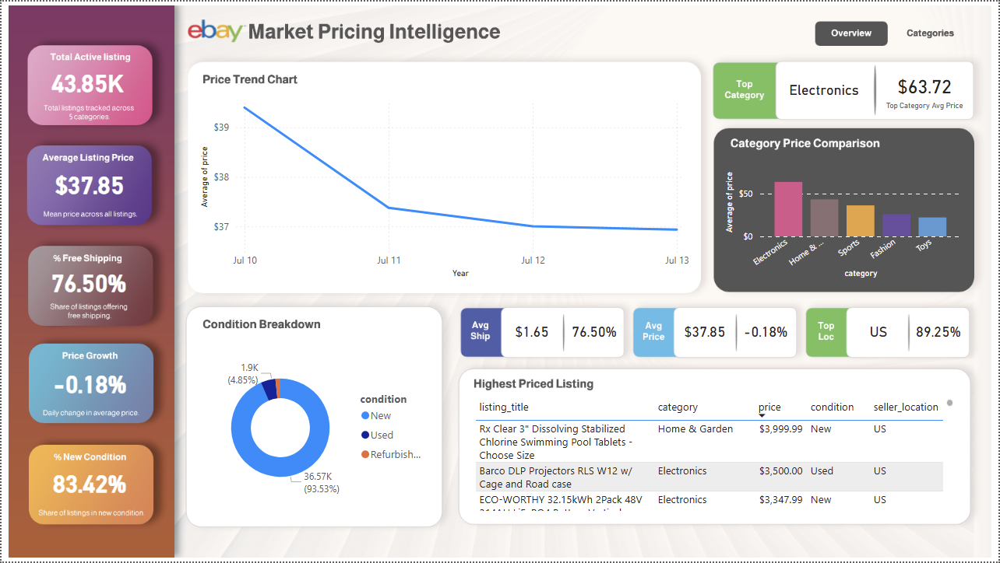
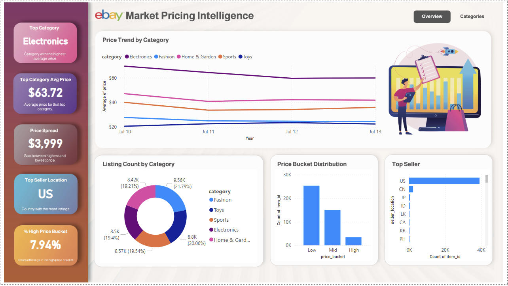

# eBay Market Pricing Intelligence

An automated data pipeline that tracks and analyzes active listing prices across 5 categories on eBay, using the official eBay Browse API, PostgreSQL (Supabase), GitHub Actions, and Power BI.

---

## Business Question

If you were selling on eBay today, what price point would be competitive in your category? Which categories command premium pricing, and how does the market shift day to day?

This project answers that by tracking live pricing data automatically, every single day, without any manual data pulling.

---

## Architecture

```
eBay Browse API (OAuth2)
        ↓
raw_ebay_listings   (Supabase, JSONB, full raw response preserved)
        ↓  [Python: clean, standardize, compute derived fields]
ebay_listings       (Supabase, clean table, deduplicated)
        ↓
Power BI Dashboard  (Session Pooler connection, 2 pages)
```

The pipeline runs automatically every day at 8:00 AM (MYT) via GitHub Actions — pulling 10,000 fresh listings (2,000 per category), storing the raw response, transforming it into analysis-ready data, and appending it to a growing historical dataset.

**Why ELT (not ETL):** raw data is preserved in its own table before any cleaning happens. If a cleaning rule ever needs to change, historical raw data can be re-processed without needing to re-scrape it — a standard pattern in modern data engineering.

### Proof of Automation

The pipeline has been running automatically, without manual intervention, since launch:



*Note: GitHub Actions scheduled triggers are best-effort, not guaranteed to the exact minute — the 2-3 hour variance seen above is documented GitHub behavior, not an issue with the pipeline itself.*

---

## Tech Stack

| Layer | Tool |
|---|---|
| Extract | Python, eBay Browse API (OAuth2 Client Credentials) |
| Storage | PostgreSQL (Supabase) |
| Transform | Python (psycopg2, batch insert) |
| Automation | GitHub Actions (daily cron) |
| Visualization | Power BI |
| Analysis | SQL (window functions, CTEs, joins) |

---

## Dashboard

### Page 1 — Overview
General market snapshot: total listings, average price, shipping trends, condition mix, and a price trend chart, plus a table of the highest-priced active listings.



### Page 2 — Categories
A deeper dive by category: which category is priced highest, how wide the price range is, where sellers are based, and how listings are distributed across price brackets.



---

## Key Findings

1. **Electronics commands premium pricing** — averaging ~$63-76 depending on the day, consistently the highest-priced category tracked.
2. **Free shipping is now the market norm**, not the exception — roughly 75-77% of listings offer it. Sellers who charge separately for shipping may appear less competitive by comparison.
3. **The market is dominated by new condition items** (83-94% of listings), suggesting these categories skew toward first-hand retail rather than resale.
4. **US-based sellers dominate the listings tracked** (~87-89%), meaning pricing benchmarks here are largely shaped by the US market.
5. **Price spread varies significantly by category** — some categories (e.g. Home & Garden) show a much wider gap between their cheapest and most expensive listings, pointing to more distinct budget vs. premium segments within that category.

---

## Challenges & How I Solved Them

**1. eBay blocked HTML scraping (403 errors)**
The original plan was to scrape sold listing data directly. After hitting persistent 403 errors — even after spoofing headers and TLS fingerprints with `curl_cffi` — I discovered eBay's Finding API (which served sold listings) had been deprecated in February 2025. I pivoted the entire project scope from "sold listings" to **active listings** via the official Browse API — a more sustainable, ToS-compliant approach that also removed all scraping-related risk.

**2. SSL certificate errors connecting Power BI to Supabase**
Power BI's PostgreSQL connector rejected Supabase's certificate by default. Fixed by disabling "Encrypt connections" in Power BI's data source settings — an acceptable trade-off for a personal analytics project.

**3. Connection string formatting issues**
Spent significant time debugging authentication failures that turned out to be caused by an unencoded `@` symbol in the database password, and later a stray space character copied into the connection string. Switched to a symbol-free password to eliminate this entire class of error going forward.

**4. Row-by-row inserts were unacceptably slow**
The first automated run took over 50 minutes to insert and transform 10,000 rows, due to executing one SQL `INSERT` per row. Rewriting both the insert and transform scripts to use `psycopg2.extras.execute_values` (batching 1,000 rows per query) cut this down to under 5 minutes end-to-end.

---

## SQL Analysis

See [`analysis_queries.sql`](./analysis_queries.sql) for additional analysis demonstrating window functions (RANK, NTILE, LAG, ROW_NUMBER), CTEs, joins between raw and clean tables, and aggregate queries — including a day-over-day price change calculation and a data quality audit comparing raw vs. transformed row counts.

---

## Project Files

| File | Purpose |
|---|---|
| `ebay_browse_api.py` | Pulls active listing data from eBay Browse API |
| `insert_raw.py` | Inserts raw JSON responses into Supabase |
| `transform_load.py` | Cleans and loads data into the analysis-ready table |
| `supabase_schema.sql` | Database schema (raw + clean tables) |
| `analysis_queries.sql` | SQL analysis queries |
| `.github/workflows/daily_pull.yml` | Automation workflow (runs daily) |

---

## Contact

**Muhamad Ibrahim**
GitHub: [github.com/muhamdimrn](https://github.com/muhamdimrn)
LinkedIn: [add your link]
